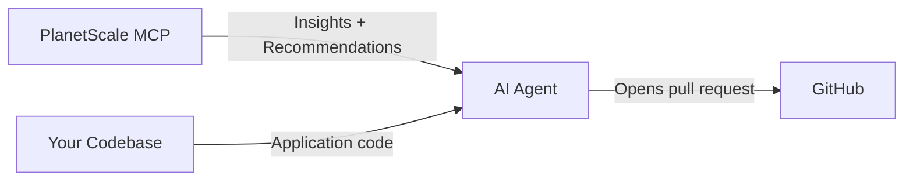

> ## Documentation Index
> Fetch the complete documentation index at: https://planetscale.com/docs/llms.txt
> Use this file to discover all available pages before exploring further.

# Self-improving database

> Use the PlanetScale MCP server with AI coding agents to continuously optimize database performance based on production Insights data and Schema Recommendations

export const PlatformAvailability = ({current, vitess, postgres}) => {
  const docsHref = path => {
    if (!path) return path;
    const normalized = path.startsWith('/') ? path : `/${path}`;
    return normalized;
  };
  const labels = {
    vitess: 'Vitess',
    postgres: 'Postgres'
  };
  if (current === 'both') {
    return <div className="not-prose mb-5 flex flex-wrap items-center gap-2" role="group" aria-label="Platform availability">
        <span data-engine="both" data-state="current" aria-current="true" className="inline-flex items-center gap-1.5 whitespace-nowrap rounded-full border px-2.5 py-1 text-[13px] font-semibold leading-tight no-underline data-[engine=vitess]:data-[state=current]:border-[#ffc59b] data-[engine=vitess]:data-[state=current]:bg-[#ffe8d8] data-[engine=vitess]:data-[state=current]:text-[#672002] dark:data-[engine=vitess]:data-[state=current]:border-[#962d00] dark:data-[engine=vitess]:data-[state=current]:bg-[#3c1403] dark:data-[engine=vitess]:data-[state=current]:text-[#ffe8d8] data-[engine=vitess]:data-[state=link]:border-[#ffc59b] data-[engine=vitess]:data-[state=link]:bg-transparent data-[engine=vitess]:data-[state=link]:text-[#b83a05] dark:data-[engine=vitess]:data-[state=link]:border-[#962d00] dark:data-[engine=vitess]:data-[state=link]:bg-transparent dark:data-[engine=vitess]:data-[state=link]:text-[#ffc59b] data-[engine=postgres]:data-[state=current]:border-[#a9dffe] data-[engine=postgres]:data-[state=current]:bg-[#ddf2ff] data-[engine=postgres]:data-[state=current]:text-[#0e3682] dark:data-[engine=postgres]:data-[state=current]:border-[#144eb6] dark:data-[engine=postgres]:data-[state=current]:bg-[#08204e] dark:data-[engine=postgres]:data-[state=current]:text-[#ddf2ff] data-[engine=postgres]:data-[state=link]:border-[#a9dffe] data-[engine=postgres]:data-[state=link]:bg-transparent data-[engine=postgres]:data-[state=link]:text-[#0b6ec5] dark:data-[engine=postgres]:data-[state=link]:border-[#144eb6] dark:data-[engine=postgres]:data-[state=link]:bg-transparent dark:data-[engine=postgres]:data-[state=link]:text-[#73c7f9] data-[engine=both]:data-[state=current]:border-[#d4d4d4] data-[engine=both]:data-[state=current]:bg-[#f0f0f0] data-[engine=both]:data-[state=current]:text-[#3d3d3d] dark:data-[engine=both]:data-[state=current]:border-[#525252] dark:data-[engine=both]:data-[state=current]:bg-[#2a2a2a] dark:data-[engine=both]:data-[state=current]:text-[#e5e5e5]">
          Vitess and Postgres
        </span>
      </div>;
  }
  const hasVitess = current === 'vitess' || Boolean(vitess);
  const hasPostgres = current === 'postgres' || Boolean(postgres);
  const only = !(hasVitess && hasPostgres);
  const engines = [];
  if (current === 'vitess' || current === 'postgres') engines.push(current);
  if (hasVitess && current !== 'vitess') engines.push('vitess');
  if (hasPostgres && current !== 'postgres') engines.push('postgres');
  return <div className="not-prose mb-5 flex flex-wrap items-center gap-2" role="group" aria-label="Platform availability">
      {engines.map(engine => {
    const isCurrent = current === engine;
    const href = docsHref(engine === 'vitess' ? vitess : postgres);
    const label = only ? `${labels[engine]} only` : labels[engine];
    const state = isCurrent || !href ? 'current' : 'link';
    if (isCurrent || !href) {
      return <span key={engine} data-engine={engine} data-state={state} aria-current={isCurrent ? 'true' : undefined} className="inline-flex items-center gap-1.5 whitespace-nowrap rounded-full border px-2.5 py-1 text-[13px] font-semibold leading-tight no-underline data-[engine=vitess]:data-[state=current]:border-[#ffc59b] data-[engine=vitess]:data-[state=current]:bg-[#ffe8d8] data-[engine=vitess]:data-[state=current]:text-[#672002] dark:data-[engine=vitess]:data-[state=current]:border-[#962d00] dark:data-[engine=vitess]:data-[state=current]:bg-[#3c1403] dark:data-[engine=vitess]:data-[state=current]:text-[#ffe8d8] data-[engine=vitess]:data-[state=link]:border-[#ffc59b] data-[engine=vitess]:data-[state=link]:bg-transparent data-[engine=vitess]:data-[state=link]:text-[#b83a05] dark:data-[engine=vitess]:data-[state=link]:border-[#962d00] dark:data-[engine=vitess]:data-[state=link]:bg-transparent dark:data-[engine=vitess]:data-[state=link]:text-[#ffc59b] data-[engine=postgres]:data-[state=current]:border-[#a9dffe] data-[engine=postgres]:data-[state=current]:bg-[#ddf2ff] data-[engine=postgres]:data-[state=current]:text-[#0e3682] dark:data-[engine=postgres]:data-[state=current]:border-[#144eb6] dark:data-[engine=postgres]:data-[state=current]:bg-[#08204e] dark:data-[engine=postgres]:data-[state=current]:text-[#ddf2ff] data-[engine=postgres]:data-[state=link]:border-[#a9dffe] data-[engine=postgres]:data-[state=link]:bg-transparent data-[engine=postgres]:data-[state=link]:text-[#0b6ec5] dark:data-[engine=postgres]:data-[state=link]:border-[#144eb6] dark:data-[engine=postgres]:data-[state=link]:bg-transparent dark:data-[engine=postgres]:data-[state=link]:text-[#73c7f9] data-[engine=both]:data-[state=current]:border-[#d4d4d4] data-[engine=both]:data-[state=current]:bg-[#f0f0f0] data-[engine=both]:data-[state=current]:text-[#3d3d3d] dark:data-[engine=both]:data-[state=current]:border-[#525252] dark:data-[engine=both]:data-[state=current]:bg-[#2a2a2a] dark:data-[engine=both]:data-[state=current]:text-[#e5e5e5]">
              {label}
            </span>;
    }
    return <a key={engine} href={href} data-engine={engine} data-state={state} title={`View ${labels[engine]} documentation`} className="inline-flex items-center gap-1.5 whitespace-nowrap rounded-full border px-2.5 py-1 text-[13px] font-semibold leading-tight no-underline data-[engine=vitess]:data-[state=current]:border-[#ffc59b] data-[engine=vitess]:data-[state=current]:bg-[#ffe8d8] data-[engine=vitess]:data-[state=current]:text-[#672002] dark:data-[engine=vitess]:data-[state=current]:border-[#962d00] dark:data-[engine=vitess]:data-[state=current]:bg-[#3c1403] dark:data-[engine=vitess]:data-[state=current]:text-[#ffe8d8] data-[engine=vitess]:data-[state=link]:border-[#ffc59b] data-[engine=vitess]:data-[state=link]:bg-transparent data-[engine=vitess]:data-[state=link]:text-[#b83a05] dark:data-[engine=vitess]:data-[state=link]:border-[#962d00] dark:data-[engine=vitess]:data-[state=link]:bg-transparent dark:data-[engine=vitess]:data-[state=link]:text-[#ffc59b] data-[engine=postgres]:data-[state=current]:border-[#a9dffe] data-[engine=postgres]:data-[state=current]:bg-[#ddf2ff] data-[engine=postgres]:data-[state=current]:text-[#0e3682] dark:data-[engine=postgres]:data-[state=current]:border-[#144eb6] dark:data-[engine=postgres]:data-[state=current]:bg-[#08204e] dark:data-[engine=postgres]:data-[state=current]:text-[#ddf2ff] data-[engine=postgres]:data-[state=link]:border-[#a9dffe] data-[engine=postgres]:data-[state=link]:bg-transparent data-[engine=postgres]:data-[state=link]:text-[#0b6ec5] dark:data-[engine=postgres]:data-[state=link]:border-[#144eb6] dark:data-[engine=postgres]:data-[state=link]:bg-transparent dark:data-[engine=postgres]:data-[state=link]:text-[#73c7f9] data-[engine=both]:data-[state=current]:border-[#d4d4d4] data-[engine=both]:data-[state=current]:bg-[#f0f0f0] data-[engine=both]:data-[state=current]:text-[#3d3d3d] dark:data-[engine=both]:data-[state=current]:border-[#525252] dark:data-[engine=both]:data-[state=current]:bg-[#2a2a2a] dark:data-[engine=both]:data-[state=current]:text-[#e5e5e5]">
            {label}
            <svg aria-hidden="true" width="12" height="12" viewBox="0 0 12 12" fill="none" className="shrink-0">
              <path d="M2.5 6h7M6.5 3l3 3-3 3" stroke="currentColor" strokeWidth="1.5" strokeLinecap="round" strokeLinejoin="round" />
            </svg>
          </a>;
  })}
    </div>;
};

export const YouTubeEmbed = ({id, title}) => {
  return <Frame>
      <iframe src={`https://www.youtube-nocookie.com/embed/${id}?rel=0`} title={title} className="aspect-video w-full" allow="accelerometer; autoplay; clipboard-write; encrypted-media; gyroscope; picture-in-picture; web-share" />
    </Frame>;
};

<PlatformAvailability current="both" />

The [PlanetScale MCP server](mcp.md) gives AI agents access to production query metrics ([Insights](../postgres/monitoring/query-insights.md)) and [Schema Recommendations](../postgres/monitoring/schema-recommendations.md) alongside your application code. This combination enables a self-improving optimization loop: an agent identifies the highest-impact performance issues, finds the relevant code, makes improvements, and opens a pull request.

This works for both Postgres and Vitess databases.

<YouTubeEmbed id="T7aof_ilvkQ" title="Self-improving database" />

## How it works



1. The agent connects to PlanetScale through the MCP server and pulls Insights data or open Schema Recommendations.
2. Identifies the highest-impact queries or schema issues.
3. Searches your codebase to find where those queries originate.
4. Makes the change in the codebase.
5. Benchmarks the change in a development environment to validate the improvement.
6. Opens a pull request with the fix and an explanation of the expected impact.

This can run as a one-off task or on a recurring schedule. [Cursor Automations](https://cursor.com/docs/cloud-agent/automations) are a great way to run this daily — they run cloud agents in the background on a schedule and support MCP server connections, making them ideal for this workflow.

## Prerequisites

* [PlanetScale MCP server](mcp.md) installed and authenticated in your AI coding tool
* [Cursor Automations](https://cursor.com/docs/cloud-agent/automations) (recommended) or another MCP-compatible coding agent such as Claude Code
* A PlanetScale database with [Insights](../postgres/monitoring/query-insights.md) data
* An `AGENTS.md` file in your repository with your PlanetScale org, database, and branch (see [Help your agent target your project's database](mcp.md#help-your-agent-target-your-projects-database))

<Tip>
  These workflows only need Insights and Schema Recommendations access. You can use the insights-only MCP server (`https://mcp.pscale.dev/mcp/planetscale-insights-only`) to avoid exposing query execution tools to the agent.
</Tip>

## Getting started

For best results, take an iterative approach:

1. **Run the prompt manually first.** Use one of the example prompts below in your AI coding tool and review the pull request it produces.
2. **Refine with guardrails.** Based on the results, add rules specific to your codebase — which directories to touch, which ORM patterns to follow, linter and test requirements, migration commands, etc.
3. **Repeat a few times.** Run it again with your refined prompt. Nudge the agent where needed. Each iteration helps you build a prompt that consistently produces high-quality PRs.
4. **Graduate to a schedule.** Once the agent reliably produces good results, set it up as a [Cursor Automation](https://cursor.com/docs/cloud-agent/automations) on a daily or weekly schedule.

<Note>
  Always review pull requests before merging. Automated agents can surface valuable optimizations, but a human should verify that the changes are safe for your workload.
</Note>

## Example prompt: Insights optimization

This prompt instructs the agent to review your Insights data, find the highest-impact queries, and optimize them. Customize the rules section for your framework, ORM, and linter.

```markdown theme={null}
You are a database performance automation expert focused on evaluating data from
PlanetScale Insights and improving application and database query performance.

Org: [your PlanetScale org]
Database: [your database name]
Branch: main

## Goal

Evaluate PlanetScale Insights data and improve the performance of the
application and database.

## How to

Use the PlanetScale MCP server to look at available Insights data. Identify
which queries are causing the most impact on the production database (slow,
high rows read, frequent, high egress). Find where in the codebase the query
is being run from and look for ways to optimize it.

## Rules

* Only fix one query at a time.
* Check existing open pull requests in GitHub. If one already exists solving
  this query pattern, pick another one.
* Before making changes, benchmark the query in a development environment
  using EXPLAIN to establish a baseline.
* After making changes, benchmark again to validate the improvement.
* Run the linter and fix any errors before opening the pull request.
* When opening the pull request, start the description with
  "Implementing PlanetScale Insights improvement" and explain why you chose
  this query to optimize. Share the potential impact of fixing it as well as
  any potential risks from making the change. Include before/after benchmark
  results.
```

<Note>
  Adapt the rules to your stack. For example, a Rails project might add: "Run migrations with `rails db:migrate` to generate the `schema.rb` file" and "Run rubocop and fix any lint errors."
</Note>

## Example prompt: Schema Recommendations

This prompt instructs the agent to evaluate open Schema Recommendations and implement them. Customize the rules section for your framework and workflow.

```markdown theme={null}
You are a database performance automation expert focused on evaluating and
implementing PlanetScale Schema Recommendations.

Org: [your PlanetScale org]
Database: [your database name]
Branch: main

## Goal

Evaluate and implement PlanetScale Schema Recommendations to improve the
performance of the application and database.

## How to

Use the PlanetScale MCP server to look at all open schema recommendations.
If any are available, pick the oldest one and implement it. If none are
available, do nothing.

## Rules

* Only fix one recommendation at a time.
* Check existing open pull requests in GitHub. If one already exists solving
  this schema recommendation, pick another one.
* Run the linter and fix any errors before opening the pull request.
* When opening the pull request, start the description with
  "Implementing PlanetScale schema recommendation" and link to the
  recommendation.

## For dropping a table or removing a column

If you need to remove a table or column, this is a two-step process.

1. Remove all code that references the table or column. When opening the pull
   request, add an important note cautioning that this action is dangerous.
   The code changes must be deployed to production before the schema changes.
2. Then make the schema change that drops the table or column once no code in
   production is making use of it.
```

## Tips for effective automations

* **One fix at a time.** Each run should address a single query or recommendation. This keeps pull requests small, reviewable, and easy to revert.
* **Benchmark in development.** Instruct the agent to run `EXPLAIN` or time queries on a development branch before and after the change. This validates the optimization and gives reviewers concrete data.
* **Use `AGENTS.md` to provide context.** Include your PlanetScale org, database, and branch so the agent doesn't have to scan through all your organizations.
* **Adapt prompts to your stack.** Add rules for your specific framework, ORM, migration tool, and linter. The more specific the guardrails, the better the output.
* **Review every PR.** Automated agents surface real improvements, but schema and query changes require human judgment before hitting production.

## Need help?

Get help from [the PlanetScale Support team](https://planetscale.com/contact?initial=support), or join our [Discord community](https://pscale.link/community) to see how others are using PlanetScale.
